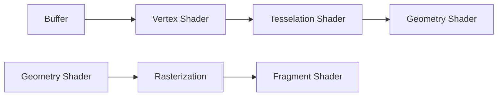

# Triangle

Creating a basic triangle is a bit of an involved process.
It is useful to contextualize some of this complexity:

**:material-download-network: Load:** This means loading data into the VRAM of the GPU.
It has a little bit of management to it (provided by OpenGL) so the operating
system can 'empty' it when the application closes (or crashes).

**:material-file-code:  Code:** Performing calculations on that data must be handled by the GPU.
Writing code for this is similar to C, but it must be compiled by OpenGL.
This is often called Graphics Programming or Shader Code.

**:material-tag-text: Describe:** There is no singular format for loading data into VRAM.
It needs to be given a "description" so the Shader Code understands it.

**:material-draw: Draw:** Finally, the correct 'draw' command must be used.
This has *some* influence on which buffers are used.

|                             | Step     | Description                 |
|-----------------------------|----------|-----------------------------|
| :material-download-network: | Load     | Put Data on the GPU.        |
| :material-file-code:        | Code     | Write Code for the GPU.     |
| :material-tag-text:         | Describe | Describe Data for the Code. |
| :material-draw:             | Draw     | Draw Shape onto screen.     |

## Overview

This Demo introduces OpenGL fundamentals for 3D rendering.

It takes a surprising amount of code to draw a basic triangle.
This chapter will go through every step in detail,
explaining Graphics Programming as it goes along.
Covering each topic with in depth makes this a pretty long read.

Doing it in a primitive manner means:

1. [Load](#load)
    1. Prepare the [vertex data](#vertex-data).
    2. Create a [buffer](#opengl-buffer) to hold the triangle data.
    3. Load the data into the buffer.
2. [Code](#code)
    1. Create a [vertex shader](#vertex-shader) to render the triangle shape.
    2. Create a [fragment shader](#fragment-shader) to render the triangle color.
    3. Turn the shaders into a Shader Program
3. [Describe](#describe)
    1. Create a 'description' of the buffered data.
4. [Draw](#draw)
    1. Render the triangle.

## Load

### Vertex Data

Each point in 3D space is a vertex (plural: vertices).
For the initial triangle, this can be done in "2D".
For OpenGL, this means using "Screen Space Coordinates."
In many programs these are the basic X and Y coordinates.
However, OpenGL uses a "normalized range" between -1 and +1.

| Axis | Normalized | Pixels (1920x1080) |
|------|------------|--------------------|
| X    | -1         | 0                  |
| X    | 0          | 960                |
| X    | 1          | 1920               |
| Y    | 1          | 0 (top)            |
| Y    | 0          | 540                |
| Y    | -1         | 1080 (bottom)      |


```python
import struct

z = 0
data = [
    # (x, y, z)
    0.0, 1.0, z,  # Top vertex
    -1.0, -1.0, z,  # Bottom left vertex
    1.0, -1.0, z  # Bottom right vertex
]

# The floating points need to be converted to bytes.
# The 'f' stands for a 32-bit floating point.
# The 'struct' module is a little bit cumbersome for this.
raw = struct.pack('f' * len(data), *data)
```

It's good to establish how the data is set up.
The triangle will be rendered as if it was 2d.
This means it is rendered in "Screen Space Coordinates".

Alternatively:

```python
import numpy as np

z = 0
vertices = np.array([
    0.0, 1.0, z,  # Top vertex
    -1.0, -1.0, z,  # Bottom left vertex
    1.0, -1.0, z  # Bottom right vertex
], dtype=np.float32)
```

### OpenGL Buffer

When putting data on the GPU, one must first make a reservation.

*:octicons-info-16: This does not allocate memory yet.*

```python linenums="1"
from OpenGL import GL

buffer_id: int = GL.glGenBuffers(1)
```

Putting data into the buffer is not as intuitive as writing to a file.
Sending data to the buffer is done by writing to a symbolic buffer. (1)
The `buffer_id` needs to be bound to such a symbol before it can be operated on.
This buffer ID (often called a `handle`) is an integer greater than 0.
{ .annotate }

1. This can be compared to using primitive X86 registers `*SI` and `*DI` which
   are used for memory operations.
   This is exactly the case for the `GL_COPY_READ_BUFFER` and `GL_COPY_WRITE_BUFFER`.

Binding a buffer is done using
`#!python glBindBuffer(target: int, buffer: int) -> void`[:octicons-link-external-16:](https://registry.khronos.org/OpenGL-Refpages/gl4/html/glBindBuffer.xhtml).<br>

- `target` is the symbol which the buffer will occupy. This is `GL_ARRAY_BUFFER` because the buffer will hold vertex
  data.
- `buffer` is the specific buffer. A value of `0` will "unbind" the buffer.

```python linenums="4"
GL.glBindBuffer(GL.GL_ARRAY_BUFFER, buffer_id)
```

Next is buffering the data.

`#!python glBufferData(target: int, size: int, data:, usage: int) -> void`

This function creates a buffer on the GPU and assigns it to the associated target.  
This means `buffer_id` is effectively a pointer to a piece of GPU memory,
and a subsequent call changes the target memory address.

- `target`, the buffer being affected.
- `size`, the size for the buffer (in bytes).
- `data`, the data to be buffered (`#!python bytes`, `#!python bytearray`, `#!python memoryview`,
  `#!python numpy.array`).
- `usage`, a hint for how the buffer will be used.

The usage is
defined [:octicons-link-external-16:](https://registry.khronos.org/OpenGL-Refpages/gl4/html/glBufferData.xhtml#description)
as follows:

- `GL_STREAM_DRAW`: the data is set only once and used by the GPU at most a few times.
- `GL_STATIC_DRAW`: the data is set only once and used many times.
- `GL_DYNAMIC_DRAW`: the data is changed a lot and used many times.

=== ":simple-python: Vanilla"

    ```python linenums="5"
    GL.glBufferData(
        GL.GL_ARRAY_BUFFER, 
        len(raw),
        raw, 
        GL.GL_STATIC_DRAW,
    )
    ```

=== ":simple-numpy: Numpy"

    ```python linenums="5"
    GL.glBufferData(
        GL.GL_ARRAY_BUFFER, 
        vertices.nbytes,
        vertices, 
        GL.GL_STATIC_DRAW,
    )
    ```

## Code

Programming for the GPU is done via GLSL (OpenGL Shading Language).
This syntax is based on C, but these examples are pretty light.
Other systems exist, but this is stable and supported without additional tooling.

GLSL usually works on a 'per item' basis. The data within an item differs.
This can be compared to a regular function, but parameters are passed differently.

Data is passed from one shader to the next.
For this demo, only the Vertex Shader and Fragment Shader are used.
Most variables within the code originate from the Vertex Buffer.
Data from other systems (like Uniforms) are discussed in later demos.

A full pipeline of shaders can be seen like this:




### Vertex Shader

The vertex shader deals with vertices, usually the points of a mesh.
The data is in the buffer, and a description was put in the VAO.
This description is used by Shaders to know where data is located.

For now, no *real* transformation is needed.
The only thing that needs to happen is converted a 3-point vector 
to a 4-point vector (for mathematical purposes.)

```glsl title="Vertex Shader"
// (1)!
#version 330 core 
layout (location = 0)  // (2)!
    in vec3 aPos; // (3)!

void main() {
    gl_Position =  // (4)!
        vec4(aPos, 1.0); // (5)!
}
```

1. This specifies the GLSL version via a `#preprocessor`.
   This is necessary, otherwise it may default to a different version depending on the installed driver.
2. This is the `layout` of data in the buffer. The `location` corresponds with the index of `glVertexAttribPointer`.
3. This is an input (`in`), it is a vector (`vec`) with a length of `3`.
   This is a specific type for OpenGL.
4. The `gl_Position` is a build-in variable.
   It is used to assign 3d coordinates
5. The `vec4` holds a 3d point. The additional value is used for transformations (later demos use this).

The source code still needs to be compiled by the graphics card.

```python title="Compile Vertex Shader"
def compile_shader(typed: int, source: str) -> int
    shader: int = GL.glCreateShader(typed)
    GL.glShaderSource(shader, source)
    GL.glCompileShader(shader)
    result: int = GL.glGetShaderiv(shader, GL.GL_COMPILE_STATUS)
    if result != 1:
        error = GL.glGetShaderInfoLog(shader)
        if isinstance(error, bytes):
            error = error.decode('utf-8')
        raise RuntimeError(error)
    return shader

compile_shader(GL.GL_VERTEX_SHADER,  "...")  # (1)! 
```

1. This should be our shader code from earlier.

### Fragment Shader

The fragment shader colors each point of the vertex.
This will be expanded upon later, but right now just use a flat color.


```glsl title="Fragment Shader"
#version 330 core
out vec4 FragColor; // (1)!

void main() {
    FragColor = vec4(1.0f, 0.5f, 0.2f, 1.0f); // (2)! 
} 
```

1. This is the output color of the shader. This is a little bit magical, but also the final step in the shader.
2. RGBA

### Compile Shader Program

When both shaders compile properly, they need to be linked together.
After all, it is a rendering pipeline and some steps might get reused.

```python
p = GL.glCreateProgram()
GL.glAttachShader(p, compile_shader(GL.GL_VERTEX_SHADER, vs))
GL.glAttachShader(p, compile_shader(GL.GL_FRAGMENT_SHADER, fs))
GL.glValidateProgram(p)
GL.glLinkProgram(p)
result: int = GL.glGetProgramiv(p, GL.GL_LINK_STATUS)
if result != 1:
    error = GL.glGetProgramInfoLog(p)
    if isinstance(error, bytes):
        error = error.decode('utf-8')
    raise RuntimeError(error)
return p
```

## Describe

With the data in the buffer, it is time to describe it.
Describing the data is necessary so the shader understands the layout of the data.

This is done by assigning attributes to it.
Attributes are grouped together by using a Vertex Attribute Object (VAO).

Creating a VAO is done the same as the VBO from earlier.
A VAO is then bound, not unlike a VBO, but no target is necessary

```python linenums="11"
vao = GL.glGenVertexArrays(1)
GL.glBindVertexArray(vao)
```

Once the VAO is bound, a description can be built.

First, the attribute must be enabled.
Our attributes start at index 0.

```python linenums="12"
GL.glEnableVertexAttribArray(0)
```

Then a description must be added to that index.

```python title="Signature GL.glVertexAttribPointer"
import ctypes


def glVertexAttribPointer(
    index: int,
    size: int,
    type: int,
    normalized: bool,
    stride: int,
    pointer: ctypes.c_void_p,
) -> None:
    ...    
```

- `index`, this is the attribute.
- `size`, this is the number of `gl_type` items belonging to this attribute.
- `gl_type`, This is the `GL_<type>` datatype. (1)
  { .annotate}

    1. `GL_BYTE`, `GL_UNSIGNED_BYTE`, `GL_SHORT`, `GL_UNSIGNED_SHORT`, `GL_INT`, and `GL_UNSIGNED_INT`

- `normalized`, normalizes the value based on the gl_type to range it between -1 and +1. (1)
  { .annotate }

    1. Takes the value and divides it by the maximum of `gl_type`.
       TODO: An appendix with examples could be nice.

- `stride`, The stride is the size of each vertex.
  This demo provides X, Y, and Z coordinates.
  Each coordinate is represented by a 32-bit (4-byte) floating point.
  This means 3 entries, multiplies by 4 bytes, resulting in a value of 12.<br>
  :warning: A value of 0 actually works for this demo, but is prone to breaking in future demos
- `pointer`, this is the offset *within* the stride.
  Providing a plain `#!python int` may result in unexpected behavior,
  so please use `ctypes.c_void_p(...)` to specify an offset (if any).
  This will become more clear when used in the next demo.

```python linenums="13"
GL.glVertexAttribPointer(
    0,  # (1)!
    3,  # (2)!
    GL.GL_FLOAT,  # (3)!
    GL.GL_FALSE,  # (4)!
    3 * 4,  # (5)!
    ctypes.c_void_p(0)
)
```

1. This is the attribute. The first attribute is index/location 0.
2. This is the number of `GL_FLOAT` items used per vertex. XYZ is 3 items.
3. This is the datatype. There will be moments where this is not a `GL_FLOAT`.
4. This is normalization, which will be addressed in other chapters.
5. Each entry is 3 elements of a 32-bit `GL_FLOAT`.

## Draw

With everything available, tie it together.

```python
GL.glClear(self.clearMask)
GL.glBindBuffer(GL.GL_ARRAY_BUFFER, buffer_id)
GL.glBindVertexArray(vao)
GL.useProgram(program)
GL.glDrawArrays(0, 3)
pygame.display.flip()
```

## Exercise: Immediate Buffering

:warning: Direct State Access was added in OpenGL 4.5 (2014)

A buffer does not have to be bound before assigning data.

1. Use `glNamedBufferData` instead of `glNamedBufferData`.
2. Replace `glGenBuffers` with `glCreateBuffers`.

The `glNamedBufferData` provides direct access to the content of the buffer.
This means it does not need to be bound before it can be modified.

The problem with `glNamedBufferData` is `glGenBuffers`.
The generated buffers have nothing associated with them, a clean slate.
OpenGL needs a *tiny* bit of state.
This can be solved by binding them once, or by using `glCreateBuffers` instead.

??? Question "How to use `glCreateBuffers` properly"

    It can be a bit tricky to use `glCreateBuffers` because it *should*
    work the same as `glGenBuffers`, but doesn't.
    This is because the wrapper of `glGenBuffers` got some sugar.

    The `glCreateBuffers` accepts a count and an output parameter.
    The output parameter is a pointer to uint32,
    so that can be given a numpy array.

    ```python
    from OpenGL import GL
    import numpy as np

    def create_vbo() -> int:
        names = np.array([0], dtype=np.uint32)
        GL.glCreateBuffers(1, names)
        return names[0]
    ```

## Exercise: Passing data between shaders

The Vertex Shader contains an X, Y, and Z position.

```glsl title="Vertex Shader"
#version 330 core
layout (location = 0) in vec3 aPos;

out vec3 ipos; // (1)

void main() {
    gl_position = aPos;
    ipos = aPos;
}
```

1. This output will be consumed by another shader.

Coloring each vertex of XYZ as if it were RGB will result in some odd colors.
The Z axis is unused, so no blue will be visible.

```glsl title="Fragment Shader"
#version 330 core
in vec3 ipos; // (1)
out vec4 FragColor;

void main() {
    FragColor = vec4(ipos.xyz, 1.0f); // (RGB, A)
} 
```

1. This is given by the Vertex Shader

The bottom-left position has a value of `-1, -1`.
This *should* get clamped back to `0.0`, but  this also means the center of the screen
(sitting at `0.0`) will be black already.

The top (X = 0, Y = 1) will become (R = 0, G = 1), making a green top.
The bottom right (X = 1, Y = -1) will become (R = 1, G = 0), making it bright red.